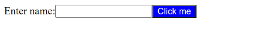
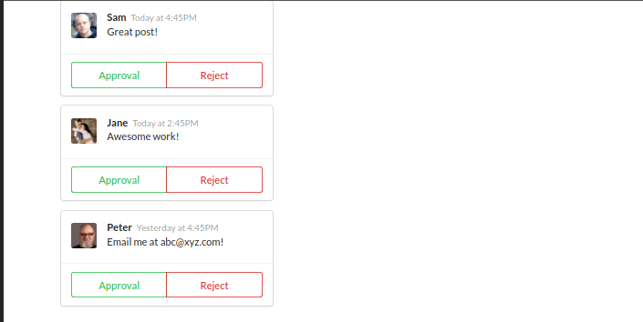
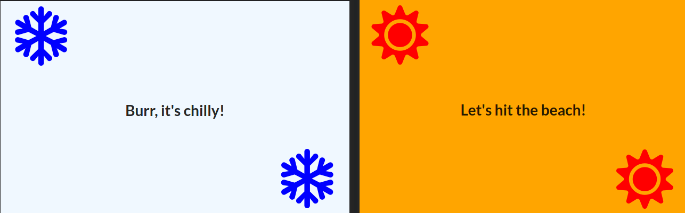
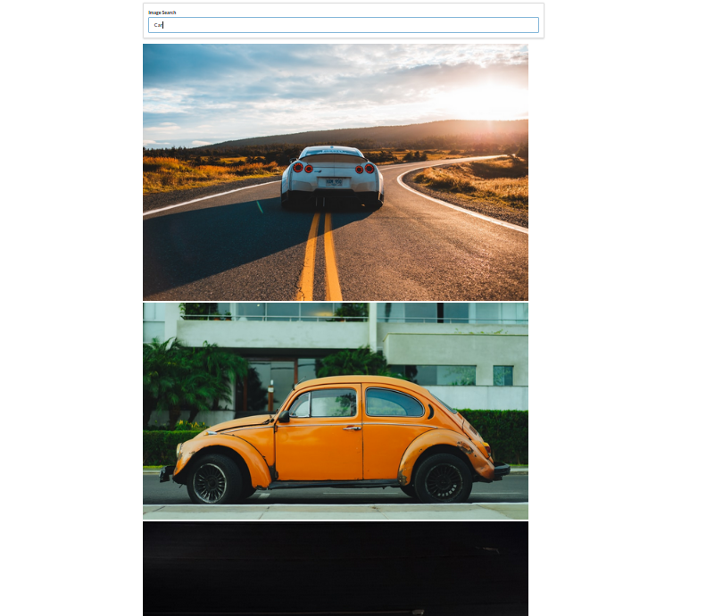
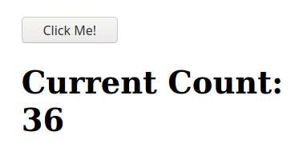
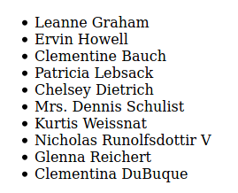

- [General](#general)
- [Projects](#projects)
  - [`jsx/`](#jsx)
  - [`components/`](#components)
  - [`seasons/`](#seasons)
  - [`pics/`](#pics)
  - [`pics-v2/`](#pics-v2)
  - [`widgets/`](#widgets)
- [Exercise Snippets](#exercise-snippets)
  - [`useState` Exercise](#usestate-exercise)
  - [`useState` and `useEffect` exercise using axios to fetch data](#usestate-and-useeffect-exercise-using-axios-to-fetch-data)
- [Progress](#progress)

# General

This repository stores source codes that are written and used as I learn React & Redux from Stephen Grider's course on Udemy.

As I go through the course, notes will be taken here:

https://akhsim.github.io/learning/Modern-React-with-Redux.html

# Projects

## `jsx/`
  
  - A simple project, just to display some Javascript variables

## `components/`
  
  - A simple comment project with mainly function-based components
  - Llearn JSX and introduces the React **props** system

## `seasons/`
  
  - A simple silly project that detects user geolocation latitude and display some text.
  - Learn **Class-base component** and more importantly, **React state system**.
  - Learn **simple state init** without `constructor()`.
  - Learn **Lifecycle methods**.
  - Learn **ternary expression**.
  - Learn to add **loading spinner**.

## `pics/`
  
  - A simple Image Lookup app
  - Learn Event Handler and alternate syntax
  - Learn **controlled v. uncontrolled React Component**.
  - Learn `event.preventDefault()`.
  - Learn `this` object.
  - Learn **how to deal with context problem** and how to use Arrow Function that allow **lexical scoping**.
  - Learn how to communicate **from Child to Parent component** using `props` to generate a callback to pass the information.
  - Learn `axios`.
    - Learn `async` / `await` function.
    - Learn custom AJAX Client.
  - Learn how to render list of records.
    - Learn Javascript array object and map statement.
    - The purpose of keys in List

## `pics-v2/`
  
  - A continuation of `pics` with images being displayed in a nicely orientated Grid.
  - Learn CSS Grid system and limitation.
  - Learn React **Ref** system and use it to dynamically style our component.
  - Learn issue with **Order of Operation**.

## `widgets/`
  - Hooks!
  - Multiple components include
    - `Accordion` component
      - Learn `useState` hook.
      - Getting the **index value** with `map()`.
    - A Wikipedia API `Search` component
      - Learn `useEffect` hook and its cleanup function
      - `dangerouslySetInnerHTML` and XSS Attack
      - Learn API throttling with `setTimeout()` and how to cancel a timer.
      - Learn React dependency error in `useEffect()` and solving it using **debounced** state.
    - `Dropdown` item selection component
      - Event Bubbling
      - Order of Event Handler invocations
      - `useRef` hook
    - `Translate` component
      - Uses Google Translate API
    - `Route` component
      - URL Routings
    - A Navigation bar component
      - Build Navigation **from sratch** using vanilla React to learn basic component routing.
      - Handle Navigation the React way by
        - Using `Route`, `Link`, and `Header` components
        - Manipulating URL using `window.history.pushState()`
        - Create and dispatch a custom `popstate` event using `dispatchEvent()`
        - Create an `EventListener` to handle the custom `popstate` event
        - Handling expected `Ctrl/Cmd + Click` behaviour by keeping browser normal behaviour


# Exercise Snippets

## `useState` Exercise


Increment current count by one every time user clicks on the button.

```js
import React from 'react';
// Don't modify this line. It is here to make React
// work correctly in this exercise environment.
const useState = React.useState;

// don't change the Component name "App"
export default function App() {
    
    const[activeCount, setActiveCount] = useState(0);
    
    const onButtonClick = () => {
        setActiveCount(activeCount+1);
    };
    
    return (
        <div>
            <button onClick={onButtonClick}>Click Me!</button>
            
            <h1>Current Count: {activeCount}</h1>
        </div>
    );
}
```

## `useState` and `useEffect` exercise using axios to fetch data

```js
import React from 'react';
import {axios} from './axios';
const { useState, useEffect } = React;

const URL = 'https://jsonplaceholder.typicode.com/users';

const App = () => {
    const [users, setUsers] = useState([]);
    
    useEffect(() => {

        const getUsers = async () => {
            const { data } = await axios.get(URL);
            setUsers(data);
        };
        
        getUsers();
    }, []);
     
    const renderedUsers = users.map((user) => {
        return <li key={user.id}>{user.name}</li>;
    });
    
    return (
        <ul>
            {renderedUsers}
        </ul>
    );
}

export default App;
```


# Progress

- [X] Session 1
- [X] Session 2
- [X] Session 3
- [X] Session 4
- [X] Session 5
- [X] Session 6
- [X] Session 7
- [X] Session 8
- [X] Session 9
- [X] Session 10
- [ ] Session 11
- [X] Session 12
- [X] Session 13
- [ ] Session 14
- [ ] Session 15
- [ ] Session 16
- [ ] Session 17
- [ ] Session 18
- [ ] Session 19
- [ ] Session 20
- [ ] Session 21
- [ ] Session 22
- [ ] Session 23
- [ ] Session 24
- [ ] Session 25
- [ ] Session 26
- [ ] Session 27
- [ ] Session 28
- [ ] Session 29
- [ ] Session 30
- [ ] Session 31
- [ ] Session 32
- [ ] Session 33
- [ ] Session 34
- [ ] Session 35
- [ ] Session 36
- [ ] Session 37
